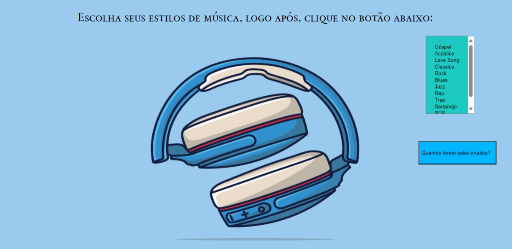

<h1 align = "center"

Interação FOR - MUSIC 🎼

</h1>

># License
>  

># Descrição do Projeto
>Este é um repositório no GitHub que apresenta um projeto com o código pronto no site  [DEVELOPER](https://developer.mozilla.org/pt-BR/docs/Web/JavaScript/Guide/Loops_and_iteration)
Algumas partes do HTML foram alterada e foi criado a estilização através do CSS.

>## Tecnologias utilizadas 🛠️
>* ``HTML5``
>* ``JS``
>* ``Github`` 
>* ``Git``
>* ``Vscode``

##  🛠️Funcionalidades
>- Coleta de informações do gosto de música do usuário.
>- Campo para o usuário selecionar o estilo de música.
>- Ver quantos gêneros de músicas foram escolhidos.

## Como Utilizar
>1. Olhe os tipos de músicas.
>2. Selecione as opções de música que tem interesse .
>3. Clique no botão "Quantos foram selecionados"

<h1 align = "center">

Elementos e Atributos Utilizados

</h1>

>* ``Button``
>É um elemento interativo ativado por um usuário com mouse, teclado, dedo, comando de voz ou outra tecnologia assistiva. Uma vez ativado, ele executa uma ação, como enviar um formulário ou abrir uma caixa de diálogo.

>* ``Img``
>incorpora uma imagem no documento.

>* ``Label``
>Representa uma legenda para um item em uma interface do usuário.

<h1 align = "center">

Informações pessoais
<h1>

* [Linkedin](https://www.linkedin.com/in/eduardo-costa-3369042bb?utm_source=share&utm_campaign=share_via&utm_content=profile&utm_medium=android_app)
* [GITHUB](https://github.com/eduardoocosta)
* [Instagram](https://www.instagram.com/duardooosta)

## Fontes Consultadas
 * [DEVELOPER](https://developer.mozilla.org/pt-BR/docs/Web/JavaScript/Guide/Loops_and_iteration)

